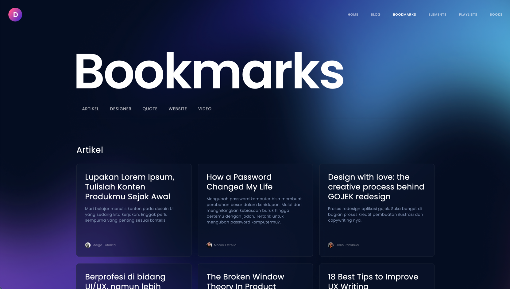
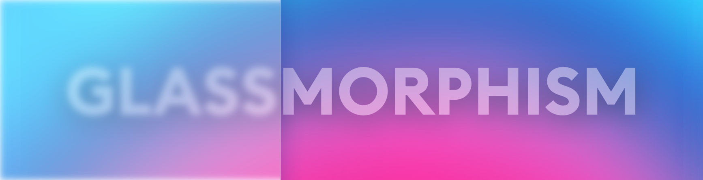

## 前言

中学时，我建立了自己的第一个个人博客。那时候正是WordPress流行的时候，一键就能部署到服务器上，非常方便。不过由于服务器开销、配置复杂等原因，浅尝辄止后我便转投了在线博客平台的怀抱。我几乎在所有博客平台上注册了账号，Blogger、博客园、CSDN、tumblr——you name it, I have it. 对比各个平台后，我选择了可定制性强且社区开发氛围好的博客园落脚，时至今日，你还可以通过[Dicerorhinus](https://cnblogs.com/rhinoc)来访问它。

大学后，阿里云年费一百多的学生机对我已不再是负荷，且彼时的我已经习惯使用Markdown编写文档，这时Hexo进入到我的视野。来自台湾的Hexo具有在大陆程序员圈子传播的天然优势，中文社区环境非常繁荣。倾心于Hexo对Markdown的原生支持，以及其丰富的插件和主题，我决定将博客搬迁到Hexo上。你可以通过[Web Archive](https://web.archive.org/web/20200207013813/https://rhinoc.top/archives/)穿越回去查看老博客。

迄今为止，我在Hexo上记录了近百篇博文，不过实习的确中断了我的写博客习惯，等到我再进入服务器时发现已经中了一年多的挖矿病毒。病毒劫持了Hosts使我无法`git clone`在线仓库的杀毒脚本，尝试手动结束进程并删除文件后病毒仍能自启动，黔驴技穷，只好重装系统了。

重装系统后，博客什么的，自然是没有了。那重新部署一遍Hexo？我迟疑了，博客系统这么多，我想探索其他的可能性。

## Why Gatsby?

我调查了目前较为主流的几个博客系统。

| 博客系统                                    | 开发语言  | 模板语言   | 类型 | 优势         |
| ------------------------------------------- | --------- | ---------- | ---- | ------------ |
| [**Hexo**](https://hexo.io/)                | Node.js   | EJS        | 静态 | 中文资料多   |
| [**Hugo**](https://gohugo.io/)              | Go        | Go         | 静态 | 编译超快     |
| [**Jekyll**](https://jekyllrb.com/)         | Ruby      | Liquid     | 静态 | /            |
| [Ghost](https://ghost.org/)                 | Node.js   | Handlebars | CMS  | 默认主题好看 |
| [**Gatsby**](gatsbyjs.com)                  | JS(React) | JS(React)  | 静态 | React        |
| [Typecho](https://typecho.org/)             | PHP       | PHP        | 静态 | /            |
| [WordPress](https://wordpress.org/)         | PHP       | PHP        | CMS  | /            |
| [Gridea](https://gridea.dev)                | JS(Vue)   | EJS        | 静态 | /            |
| [**Gridsome**](https://gridsome.org/)       | JS(Vue)   | JS(Vue)    | 静态 | Vue          |
| [Halo](https://halo.run/)                   | Java      | Freemarker | CMS  | /            |
| [**Pelican**](https://blog.getpelican.com/) | Python    | Jinja      | 静态 | Python       |


由于我本来就有一台服务器，所以静态页面还是CMS对我的影响不大，我的主要选择条件有这些：

1. 原生支持Markdown，且可通过插件实现扩展语法
   * ~~WordPress~~
2. 生态繁荣，有大量免费可用的插件和主题
   * ~~Ghost, Gridea, Halo~~
3. 项目活跃，能得到持续的更新支持
   * ~~Typecho, Gredia~~
4. 模板可定制程度高，尽可能使用我熟悉的技术栈
   * ~~Hugo, Jekyll, Gridsome, Pelican~~

由于第四个条件因人而异，表格中对满足前三个条件的博客系统名称进行了加粗。

对我来说，Gatsby就是我的不二之选了。

[[info]]
|* 静态页面：
|	1. 无后端，相对安全  
|	2. 部署简单便宜，使用第三方服务甚至免费  
|	3. 一般一个Markdown对应一个页面，迁移成本低
|	4. 本机编辑文件发布到线上，不够灵活
|* CMS：
|	1. 有后端，面临数据库被攻击的危险  
|	2. 需要部署到服务器上，有服务器开销  
|	3. 使用数据库储存页面信息，迁移成本高  
|	4. 提供在线的后台页面，发布方式灵活  
|
|可以使用Headless CMS作为静态页面的内容来源，实现诸如Ghost+Gatsby的级联使用。

## 网页设计

选择Gatsby的一大原因就是「React，这玩意我熟悉啊」。所以不大刀阔斧重构下博客页面可说不过去。不过设计的灵感我是没有的，只能逛逛Dribbble和一些知名博客，把觉得好的设计都截图保存下来。

### 玻璃拟态

当我看到[Dwinawan的博客](https://dwinawan.com/bookmark.html)时，「决定就是你了，<ruby>玻璃拟态<rt>Glassmorphism</rt></ruby>」。



玻璃拟态具有如下特征：

* 透明+背景模糊形成的毛玻璃效果
* 鲜艳的渐变背景（用来突出透明效果）
* 纤细的浅色边框模拟玻璃边缘
* 通过改变阴影和透明度形成层次感



玻璃拟态非常适合渐变色的背景，在纯色背景下可能会稍显单调，不过还是可以通过阴影和边框来保持层次感。

值得注意的是，玻璃拟态并不适用于所有场合，它更适合作为卡片背景而不是像按钮一样需要高对比度的地方。所以在我的博客中，都只将毛玻璃应用到了卡片上，比如首页的博文卡片、悬浮目录的面板等。

### 博文排版

确定整体风格后，还有一个大头就是文章的排版，毕竟博客存在的意义就是文字的输出。

你可以通过示例页面[Hello, World](/posts/hello-world/)查看不同元素的排版。

我对小标题进行了如下处理：

* 每个二级标题 `<h2>` 前加上井字符号（一级标题对应文章标题，正文中一般不会出现），方便滚动浏览时快速定位。
* `<h3>` ~ `<h6> `在hover状态同样会显示井字符号，方便复制链接。
* 标题的上间距>下间距，与上文分隔开。
* 对于级联的标题，比如二级标题下紧接着三级标题，会减少它们之间的间距。

正文部分，我使用了1.5倍的行距，1.25倍的段落间隔，保证段落结构的清晰。

此外，在列表、块引用和链接部分，都使用了主题色进行点缀和强调。

## 开发实现

### 玻璃拟态效果

1. 使用1px的半透明白色模拟玻璃边缘。

2. 使用放射渐变模拟玻璃面。这里我是通过Figma先调试好后再复制对应的样式代码。
3. 使用 `backdrop-filter: blur()` 实现背景模糊。但CSS中模糊滤镜的性能很差，在背景变化（比如背景固定时滚动页面等<ruby>视差滚动场景<rt>Parallax Scrolling</rt></ruby>）时帧数会出现明显下降，甚至出现内容丢失。虽然可以使用 `backface-visibility` 等属性强制硬件加速，不过性能提升因人而异，建议还是不要在滚动页面使用模糊滤镜。

```css
.glass {
    box-shadow: rgba(0, 0, 0, 0.06) 0px 5px 30px;
    border: 1px solid rgba(255, 255, 255, 0.1);
    border-radius: 8px;
    background: radial-gradient(100% 216.12% at 1.81% 0%, rgba(0, 0, 0, 0.2) 0%, rgba(0, 0, 0, 0.1) 100%);

  	backface-visibility: hidden;
    perspective: 1000;
    transform: translate3d(0,0,0);
    transform: translateZ(0);
  	backdrop-filter: blur(.6rem);
}
```

### 代码块

#### 语言指示符

代码高亮使用了[gatsby-remark-prismjs](https://www.gatsbyjs.com/plugins/gatsby-remark-prismjs/)插件，并且可以利用其生成的HTML属性信息在代码块上显示代码语言。

```html
<!--PrismJS生成的HTML-->
<!--highlight-next-line-->
<div class="gatsby-highlight" data-language="bash">
  <pre class="language-bash">
  	<code class="language-bash">print hello, world<span class="token operator">!</span>
	  <span class="token comment"># comment here...</span
	  </code>
  </pre>
</div>
```

我们就可以利用 `data-language` 属性的值在代码块前创建一个伪元素，起到指示代码语言的作用：

```css
.gatsby-highlight::before {
  content: attr(data-language);
  position: absolute;
  top: 0px;
  left: 1.5rem;
  
  border-radius: 0px 0px 4px 4px;
  padding: 0.25rem 0.5rem;
  background: black;
  font-size: 0.75rem;
  color: white;
}
```

当然还可以为不同语言设置不同的背景颜色：

```css
.gatsby-highlight[data-language="bash"]::before {
  color: black;
  background: rgb(136, 224, 81);
}
```

编程语言颜色可以参考[github-colors](https://github.com/ozh/github-colors).

#### 代码块标题栏

使用了插件[gatsby-remark-code-titles](https://github.com/DSchau/gatsby-remark-code-titles)，其作用是在代码块前生成一个同级的 `<div>` 元素，可以利用这个元素来模仿macOS窗口的标题栏。

```css
.gatsby-code-title {
  box-shadow: rgb(255 255 255 / 50%) 0px 1px 0px inset, rgb(81 81 81) 0px 1px 0px;
  border: 1px solid rgb(185, 188, 189);
  border-top-left-radius: 0.35rem;
  border-top-right-radius: 0.35rem;
  padding: 0.2rem 2rem;
  background: linear-gradient(rgb(234, 234, 234), rgb(210, 210, 210));
  font-size: 0.9rem;
  line-height: 1;
  text-align: center;
  text-shadow: rgb(255 255 255 / 50%) 0px 1px 0px;
  color: rgb(77, 73, 77);
}
```

#### 代码复制按钮

代码复制使用了[gatsby-remark-code-buttons](https://github.com/iamskok/gatsby-remark-code-buttons)插件。同样也是在代码块前生成一个同级 `<div>` 元素，使用绝对定位使其位于代码块内。

```css
.gatsby-code-button-container .gatsby-code-button {
  position: absolute;
  top: 0.3rem;
  right: 0.3rem;
  font-size: 0.75rem;
  color: rgb(255, 255, 255);
}
```

由于该插件还存在SVG、Tooltip、Toaster等元素，所以还需要将这些元素 `display: none;` 。

### 自定义Markdown语法

使用[gatsby-remark-custom-blocks](https://www.gatsbyjs.com/plugins/gatsby-remark-custom-blocks/)实现。

### 悬浮目录

使用[Tocbot](https://tscanlin.github.io/tocbot/)实现悬浮目录。

## Credits

* [Dwinawan](https://dwinawan.com/bookmark.html)
  * 背景中的渐变色线条 Gradient lines in the background (**use material directly**)
  * 深色模式下的背景图片 Background image in dark mode (**use material directly**)
  * 网页右上方导航栏布局 Layout of the top right navigation bar (for inspiration)
  * 首页分类导航栏布局 Layout of the category navigation in INDEX page (for inspiration)
  * 博文页面头像布局 Layout of avatar and name in POST page (for inspiration)
  * 毛玻璃质感 Glass morphism (for inspiration)
* [Apple Memoji](https://support.apple.com/en-us/HT208986)
  * 我的头像 My avatar (**use material directly**)
  * About页面头图 Image in ABOUT page (**use material directly**)
* [Tania Rascia](https://www.taniarascia.com/)
  * 仿macOS标题栏的代码块样式 macOS title bar like code block (**use source code directly**)
* [GatsbyJS](https://www.gatsbyjs.com/plugins/gatsby-theme-blog/)
  * 代码块代码语言指示符布局 Language indicator in code block (**use source code directly**)
  * 代码块复制按钮布局 Copy button in code block (for inspiration)
* [CSS Tricks](https://css-tricks.com/)
  * 博文页面返回顶部按钮 Back to top button in POST page (for inspiration)
* [TriDiamond's Blog](https://tridiamond.tech/)
  * 博文页面标签按钮 Tag button in POST page (for inspiration)
* [Seva](https://dribbble.com/shots/5893791-Figma-DailyUI-085-Pagination)
  * 分页组件布局 Pagination (for inspiration)

## 参考资料
* [Which is the Best Static Site Generator and Why? - Dev.to](https://dev.to/oyetoket/which-is-the-best-static-site-generator-and-why-42e2)
* [CSS Blur Filter Performance - StackOverflow](https://stackoverflow.com/questions/31713468/css-blur-filter-performance)
* [Glassmorphism in user interfaces - UX Collective](https://uxdesign.cc/glassmorphism-in-user-interfaces-1f39bb1308c9)